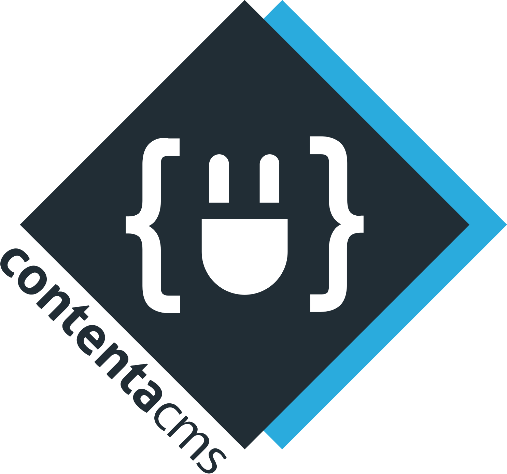

<!--
  This file was generated by emdaer

  Its template can be found at .emdaer/README.emdaer.md
-->

<!--
  emdaerHash:d746b9cdabfcb6fce01bfcc5c7b276fa
-->

<h1 id="contentajs-redis-img-align-right-src-logo-svg-alt-contenta-logo-title-contenta-logo-width-100-">ContentaJS - Redis </h1>
<p>This project is part of the
<a href="https://www.npmjs.com/package/@contentacms/contentajs">ContentaJS</a> project. You
need to install it inside of a ContentaJS project.</p>
<!-- toc -->
<ul>
<li><a href="#installation">Installation</a><ul>
<li><a href="#install">Install</a></li>
<li><a href="#add-the-redis-configuration">Add the Redis configuration</a></li>
</ul>
</li>
<li><a href="#contributors">Contributors</a></li>
<li><a href="#license">License</a></li>
</ul>
<!-- tocstop -->
<p><a href="https://travis-ci.org/contentacms/contentajsRedis/"></a> <a href="https://coveralls.io/github/contentacms/contentajsRedis/"></a> <a href="https://github.com/emdaer/emdaer"></a></p>
<h2 id="installation">Installation</h2>
<p>In order to use Redis as your cache back-end in ContentaJS you will need to:</p>
<h3 id="install">Install</h3>
<p>Install this module in your ContentaJS forked project:</p>
<pre><code>
yarn add @contentajs/redis
</code></pre>
<h3 id="add-the-redis-configuration">Add the Redis configuration</h3>
<p>Add the Redis configuration to your configuration files in ContentaJS, and
make Redis your active cache back-end. Make sure to configure Redis with your
actual host, port, and any
<a href="http://redis.js.org/#api-rediscreateclient">additional options you need</a>.
Modify your
<a href="https://github.com/lorenwest/node-config/wiki/Configuration-Files">config file</a>
with:</p>

```yaml
# NOTE: Append the 'redis' section under 'plugins'

[](https://greenkeeper.io/)

applicationCache:
  activePlugin: redis # <--- ACTIVATE REDIS
  plugins:
    lru: … # You can keep existing configuration to switch back if needed.
    foo: …
    bar: …
    redis: # <--- APPEND THIS SECTION
      # Additional options for node_redis
      # http://redis.js.org/#api-rediscreateclient passed verbatim.
      host: 127.0.0.1
      port: 6379
      prefix: 'contentajs::'
```
<h2 id="contributors">Contributors</h2>
<details>
<summary><strong>Contributors</strong></summary><br>
<a title="Engineer and programmer focused on online applications." href="https://github.com/e0ipso">
  
</a>
<strong>Mateu Aguiló Bosch</strong>
<br><br>
</details>

<h2 id="license">License</h2>
<p>@contentacms/redis is <a href="./LICENSE">MIT licensed</a>.</p>
